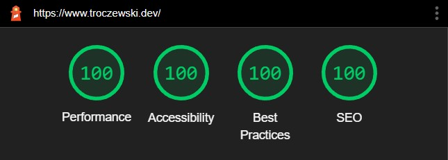

# Personal blog - [troczewski.dev](https://www.troczewski.dev/) 👀

## Blog and a portfolio at once 🔥

It's scientifically proven that taking notes is best to organize knowledge. I gave it a try, and after even writing one article I improved. I learned how to publish a page at a certain domain in the network too.

### Website goals:

- Shows learning path 📈
- Summarizes my knowledge 🏫
- Publicizes my private thinkings 🤯
- Links to my programming-associated socials 🔗

### Core used technologies:

| Technology                                    | Description                                                   |
| --------------------------------------------- | ------------------------------------------------------------- |
| [NextJS](https://nextjs.org/)                 | The React Framework for Production                            |
| [TypeScript](https://www.typescriptlang.org/) | strongly typed programming language that builds on JavaScript |
| [SCSS](https://sass-lang.com)                 | CSS with superpowers                                          |
| [MDX](https://mdxjs.com/)                     | MDX allows to use JSX in markdown content                     |

### Lighthouse result 👇

For now, this website is only written in Polish. But with time I will add internationalization support with the English language.
